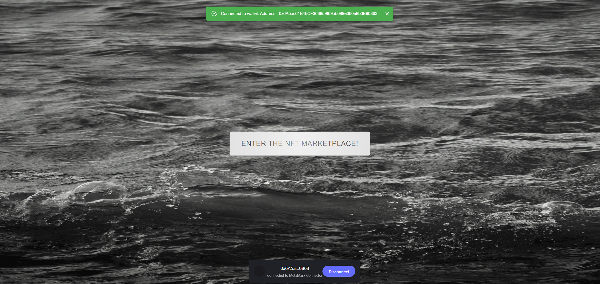
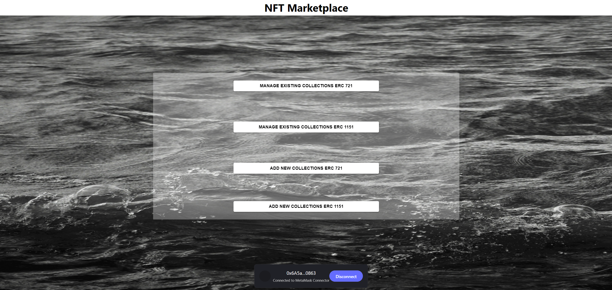
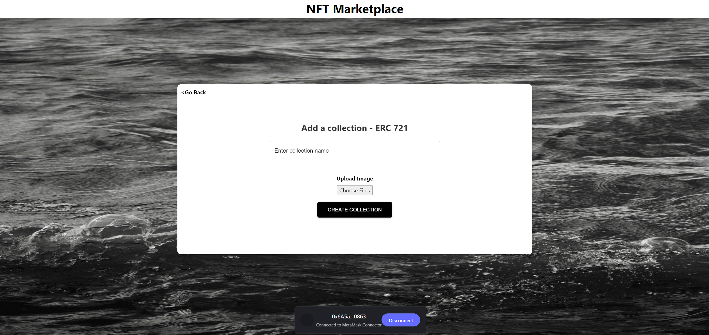
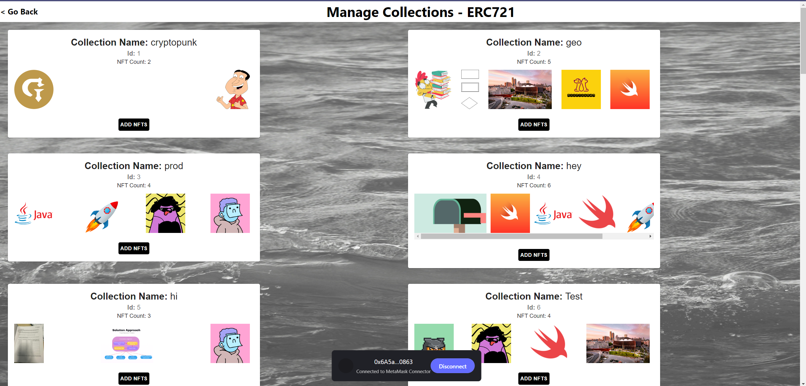

NFT Marketplace

Welcome to the NFT Marketplace, a decentralized platform built with React for trading and discovering unique digital assets. Leveraging the power of blockchain, our marketplace provides a secure and user-friendly environment for crypto enthusiasts and art collectors alike.

NFT Marketplace is deployed at: [https://bitter-frost-4981.on.fleek.co](https://nameless-flower-2680.on.fleek.co/)

Features
Creating NFT collection and minting NFTs into them using ERC 721 and ERC 1155 contracts.
Wallet Integration: Seamlessly connect your Ethereum wallet using wagmi to interact with the marketplace.
IPFS Deployment: Access our platform anywhere thanks to our deployment on IPFS, ensuring decentralization and reliability.
Getting Started
Follow these simple steps to get the NFT Marketplace running on your local machine for development and testing purposes.

Sample Screenshots:

Prerequisites
Ensure you have Node.js installed on your system.
Installation
Clone the Repository

Start by cloning the repository to your local machine:

git clone [https://github.com/9656pawankumar/NFT_Market.git](https://github.com/9656pawankumar/nft-assignment)

Navigate to the project directory cd NFT-marketplace

Run the build script (which includes npm install) npm run build

Start the development server npm start
